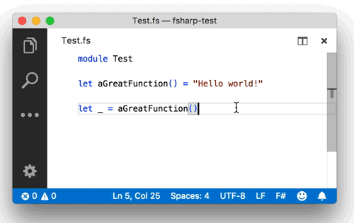
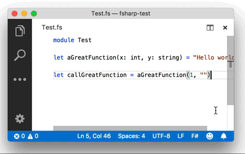
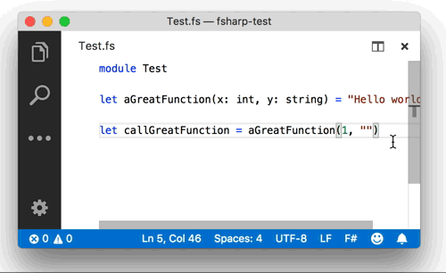
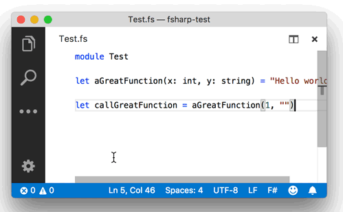

# F# Language Server
This project is an implementation of the [language server protocol](https://microsoft.github.io/language-server-protocol/) using the [F# Compiler Service](https://fsharp.github.io/FSharp.Compiler.Service/).

## Features

### Hover

### Autocomplete

### Method signature help

### Find symbols in document

### Find symbols in workspace

### Go-to-definition

### Find references

### Rename symbol

### Show errors on save

### Run & Debug tests

## Code structure
The language server protocol (LSP) is very similar to the API defined by the F# compiler service (FCS); most of the implementation is devoted to translating between the types used by FCS and the JSON representation of LSP.

- client/extension.ts: Client-side VSCode launcher
- sample: Example projects used by tests
- scripts: Scripts for building and testing
- src/LSP: Server-side implementation of [language server protocol](https://microsoft.github.io/language-server-protocol/specification)
- src/ProjectCracker: Figures out [F# compiler options](https://docs.microsoft.com/en-us/dotnet/fsharp/language-reference/compiler-options) using [Buildalyzer](https://github.com/daveaglick/Buildalyzer) and the MSBuild API.
- src/FSharpLanguageServer: F# language server
- tests/LSP.Tests
- tests/ProjectCracker.Tests
- tests/FSharpLanguageServer.Tests
- videos: Animated GIFs on this page

## Installation

### VSCode
[Install from the VSCode extension marketplace](https://marketplace.visualstudio.com/items?itemName=georgewfraser.fsharp-language-server)

### Vim
**Help wanted**--should be straightforward with [LanguageClient-neovim](https://github.com/autozimu/LanguageClient-neovim) or [vim-lsp](https://github.com/prabirshrestha/vim-lsp), a PR with instructions here would be appreciated.

### Emacs
**Help wanted**--should be straightforward with [emacs-lsp](https://github.com/emacs-lsp/lsp-mode), a PR with instructions here would be appreciated.

## How is this project different than [Ionide](https://github.com/ionide)?
Ionide is a suite of F# plugins for VSCode; F# language server is analagous to the [FSAC](https://github.com/fsharp/FsAutoComplete) component. While FSAC is based on a custom JSON protocol; F#LS is based on the [language server protocol](https://microsoft.github.io/language-server-protocol/specification) standard. 

The implementation is a thin wrapper around [F# Compiler Service](https://fsharp.github.io/FSharp.Compiler.Service/) and is heavily focused on performance. For example, autocompleting in medium-sized file in F# Language Server (left) and Ionide (right):

